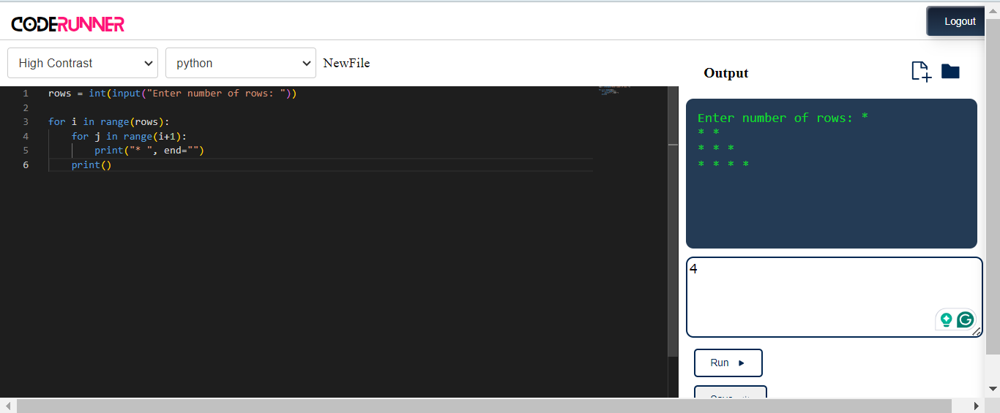

# CodeRunner Web

Welcome to CodeRunner Web! CodeRunner Web is a powerful web-based application that allows you to write, run, and debug code directly in your browser. Whether you're a seasoned developer or just starting out, CodeRunner Web provides a seamless and efficient coding experience.

## Features

1. **Multi-Language Support:** CodeRunner Web supports a wide range of programming languages, including but not limited to Python, JavaScript, and many more.
2. **Real-Time Code Execution:** Write your code and see the results instantly with our real-time code execution feature.
3. **Integrated Code Editor:** Our intuitive and feature-rich code editor offers syntax highlighting, code completion, and indentation assistance.
6. **Save and Share Code Snippets:** Save your code snippets for future reference.

## Getting Started

1. **Sign Up or Log In:** Create an account or log in to your existing account to access CodeRunner Web's full range of features.
2. **Select Your Language:** Choose the programming language you want to code in from the dropdown menu.
3. **Write and Run Code:** Start writing your code in the editor pane and press the "Run" button to execute it.
5. **Save** Save your code snippets.

## System Requirements

CodeRunner Web runs entirely within your browser, so there's no need to download or install any additional software. Simply ensure you have a modern web browser with JavaScript enabled.

You can find the hosted version at the link here
[CodeRunner Web](https://code-runner-web.netlify.app)

Happy coding!

*Brian-Kipyegon*
